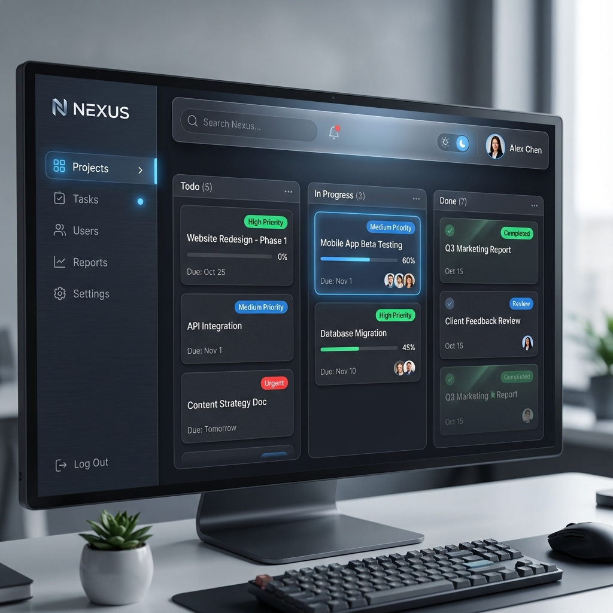
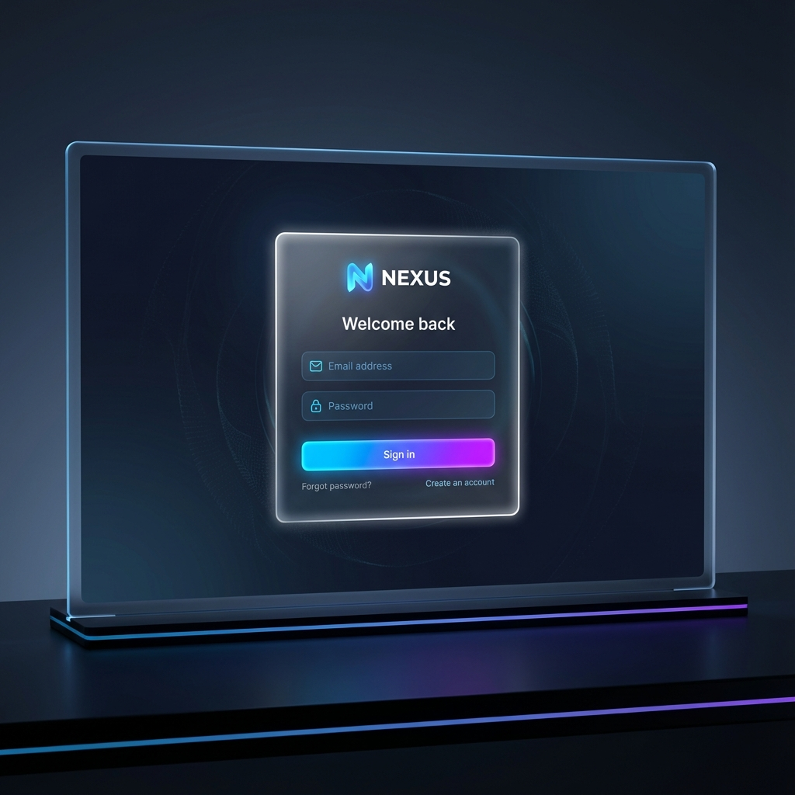

# Project Nexus 🚀

**Project Nexus** is a state-of-the-art Project Management SaaS application built to empower high-performance teams. It combines robust backend security with a premium, glassmorphism-inspired frontend design.



## 🌟 Key Features

- **Premium UI/UX**: A stunning interface featuring Glassmorphism, tailored Dark/Light modes, and smooth micro-interactions.
- **Secure Authentication**: JWT-based security with bcrypt password hashing and secure login/register flows.
- **Kanban Task Management**: Drag-and-drop task organization (In Progress).
- **Team Collaboration**: Verified user profiles and secure data handling.
- **Clean Architecture**: Built on .NET 9 (Backend) and Angular 19 (Frontend) following industry best practices.

## 📸 Previews

### Secure Login Screen



### Modern Dashboard

_(As seen in header)_

## 🛠 Tech Stack

### Backend (.NET 9)

- **Core**: ASP.NET Core Web API
- **Data**: Entity Framework Core 9 (SQL Server)
- **Security**: JWT Bearer Auth, BCrypt.Net
- **Architecture**: Clean Architecture (Domain, Application, Infrastructure, API)
- **Documentation**: Scalar Key

### Frontend (Angular 19)

- **Core**: Angular Standalone Components, Signals
- **Styling**: Tailwind CSS, Custom Glassmorphism Theme
- **Icons**: Lucide Angular
- **Features**: Dark Mode Toggle, Responsive Design

## 🚀 Getting Started

### Prerequisites

- .NET 9 SDK
- Node.js & npm
- SQL Server

### Installation

1.  **Clone the repo**

    ```bash
    git clone https://github.com/mrtylmz99/CalendarApp.git
    cd CalendarApp
    ```

2.  **Backend Setup**

    ```bash
    cd Nexus.API
    dotnet restore
    dotnet run
    ```

3.  **Frontend Setup**
    ```bash
    cd Nexus.Client
    npm install
    npm start
    ```

## 🧪 Testing

To run the unit tests:

```bash
dotnet test
```

## 📝 Logging

All application logs and errors are automatically saved to the `AppLogs` table in the database.

## 📄 License

This project is licensed under the MIT License.
